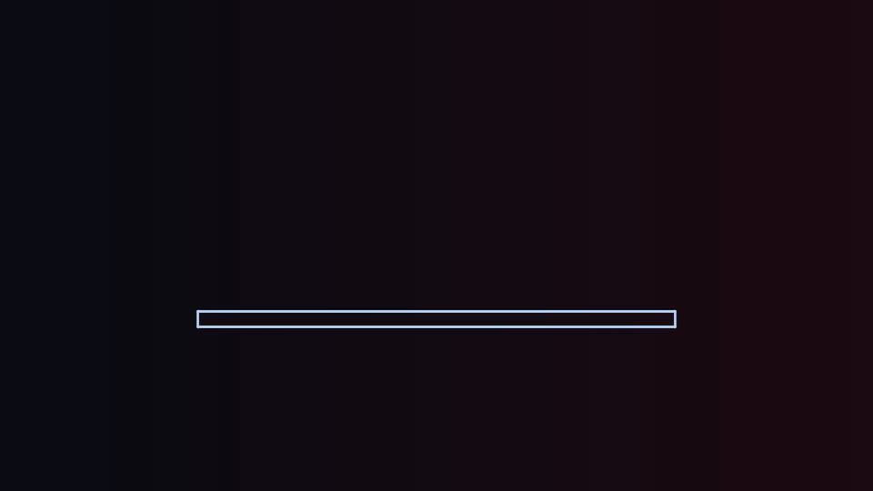

# Video-Code
The initial goal of this project is to create videos from code.<br>
I've always wanted to create millimetric videos and I will be able to, soon enough.

The second thought is that such thing can be used to automate the generation of video.<br>
AI have a hard time with designs, they are better with code, they could potentially take advantage of this project to generate videos with a good quality and a logical flow.

Thirdly, I want the program to have a visual interface like any other video editing app but I want it to be automatically generated from the Python API.<br>
With a code and a visual interface, anyone can make videos according to their liking.

Below is an example of the last feature added (code) and the result (video).


```py
#!/usr/bin/env python3

from videocode import *

BG = LinearGradient(rgba(10, 12, 20), rgba(30, 10, 18))

Text("Latest Feature", fontSize=0.3, fillColor=WHITE | 0.65).position(0, 3.2).fadeIn(duration=0.4)

title = Text("FIRE", fontSize=2.8, fillColor=fire(speed=2.2, quality=0.9)).position(0, 1.0)
title.fadeIn(duration=0.8)

bar = Rectangle(width=8.8, height=0.34, cornerRadius=20, fillColor=WHITE | 0.12).position(0, -1.35)
bar.apply(lightSweep(width=24, intensity=0.9, angle=18), duration=5.4)

caption = Text("shader fills + selective clock pausing", fontSize=0.22, fillColor=WHITE | 0.72).position(0, -2.2)
caption.fadeIn(duration=0.4)

phase1 = Text("wait(1.2)  ->  flames keep moving", fontSize=0.2, fillColor=WHITE).position(0, -3.0)
phase1.fadeIn(duration=0.25)
wait(1.2)

phase1.fadeOut(duration=0.2)
phase2 = Text("wait(1.2, stop=Clock.PAINTS)  ->  fire freezes, sweep keeps moving", fontSize=0.18, fillColor=WHITE).position(0, -3.0)
phase2.fadeIn(duration=0.2)
wait(1.2, stop=Clock.PAINTS)

phase2.fadeOut(duration=0.2)
phase3 = Text("freeze(1.2)  ->  paints and effects pause together", fontSize=0.18, fillColor=WHITE).position(0, -3.0)
phase3.fadeIn(duration=0.2)
freeze(1.2)

phase3.fadeOut(duration=0.3)
Text("fire(), silk(), starNest(), mathShader(...)", fontSize=0.2, fillColor=WHITE | 0.85).position(0, -3.0).fadeIn(duration=0.3)
wait(1.8)
```



## Getting Started
To create a video with Video-Code, you need to write some simple code in Python.

The flow of the Video comes from the __Inputs__ that you, first create, then modify with __Transformations__ and finally add to the __timeline__.

To create an __Input__, use one the methods created according to what you need, it can be a __video__, an __image__ or a __text__, etc...<br>
To modify it, you need to use __Transformations__ like __moveTo__ or __scale__.<br>
To add the frames of the __Input__ to the timeline, use the __\<Input\>.add()__ function.

### Installation

To install the project, checkout the [documentation](docs/user/user.md#installation).

## Patch Notes


<details open>
    <summary><code>Inputs</code></summary>
<br>

- `image`
- `video`
- `webImage`

<br>

- `circle`
- `rectangle`
- `square`
- `line`

<br>

- `text`

<br>

- `group`

</details>

<br>

<details open>
    <summary><code>Transformations</code></summary>
<br>


- `position`
- `align`
- `rotate`
- `scale`
- `args`
- `hide`
- `show`

</details>

<br>

<details open>
    <summary><code>Shaders</code></summary>
<br>

- `grayscale`
- `opacity`
- `blur`
- `gamma`
- `grain`
- `brightness`
- `contrast`
- `sharpen`

</details>

<br>

<details open>
    <summary><code>Effect Templates</code></summary>
<br>

- `moveTo`
- `moveBy`

<br>

- `scaleTo`
- `scaleBy`

<br>

- `fadeIn`
- `fadeOut`

</details>

<br>

<details>
    <summary><code>Patchs</code></summary>
<br>

- `feature`: start and duration of transformation (08/04/25)
- `rework`: inputs are kept on the video by default (08/04/25)
- `feature`: wait -> freeze the screen for the duration (08/04/25)
- `transformation`: setPosition (08/04/25)
- `rework`: move -> moveTo (08/04/25)
- `input`: group (08/04/25)
- `input`: rectangle (24/03/25)
- `input`: circle (24/03/25)
- `transformation`: scale (20/03/25)
- `transformation`: zoom (19/03/25)
- `rework`: effects' duration (19/03/25)
- `transformation`: grayscale (19/03/25)
- `feature`: keep last frame of input on screen (06/03/25)
- `rework`: one stack (06/03/25)
- `transformation`: repeat (03/03/25)
- `input`: text (03/03/25)
- `rework`: position of the frames (02/03/25)
- `transformation`: move (02/03/25)
- `feature`: setters (update in real time the proportions of a shape) (20/09/25)
- `fix`: different framerate between the window and the generated video
- `feature`: image from url
- `rework`: moveTo
- `rework`: scale
- `feature`: persistent transformations
- `input`: line (01/01/2026)
- `transformation`: align, args, hide, position, rotate, scale, show => basic transformation (01/01/2026)
- `template`: moveTo, moveBy, scaleTo, scaleBy, fadeIn, fadeOut => effect overtime that are smooth (01/01/2026)
- `feature`: flush => prevents effects to be applied at the same time (01/01/2026)
- `feature`: frames are not kept in memory anymore, they are generated on the fly. (01/01/2026)

</details>

