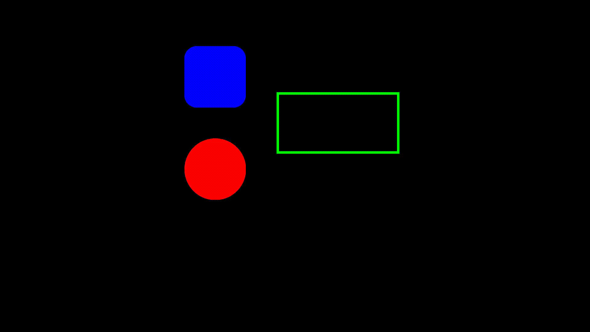

# Video-Code
The goal of this project is to create videos with code.

Below is an example of the last feature added (code) and the result (video).

```py
from frontend.VideoCode import *


v1 = video("video/v.mp4")

v1[0:20].apply(fadeIn()).add()
v1[20:40].apply(fadeOut()).add()
```


